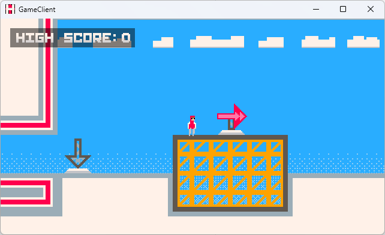

# Heights
## A multiplayer platformer.

The game's client and server both need the `Content` directory to run. Place the client/server executable in the same directory as `Content` before running them. Or, in your IDE change your working directory to the directory that contains `Content` before running.

